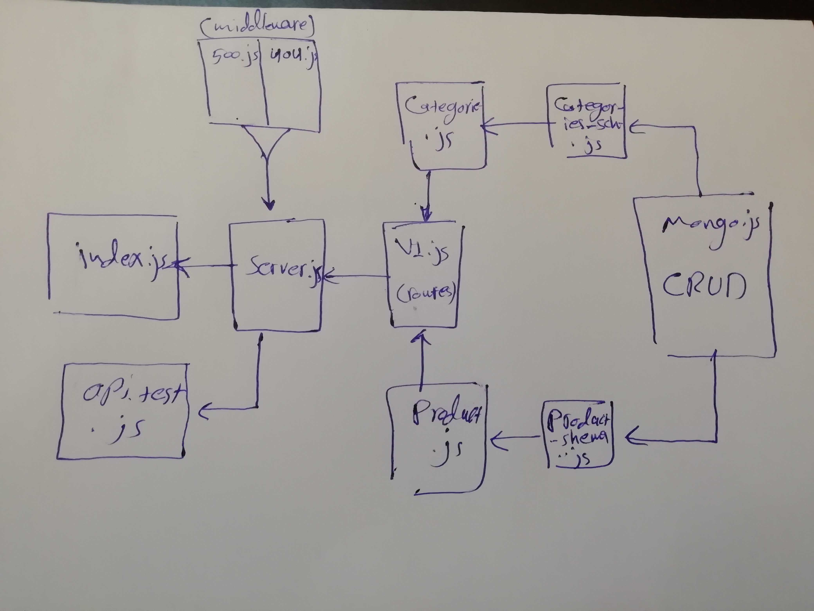

# LAB - Class 09

## API Server

### Author: Ibrahim/Naseem/Obada

### Links and Resources

* [submission PR](https://github.com/401-advanced-javascript-ibrahim/lab-09-api-server/pull/2)
* [ci/cd](https://github.com/401-advanced-javascript-ibrahim/lab-09-api-server/actions) (GitHub Actions)

### Setup

#### `.env` requirements (where applicable)

* `PORT` - 3000
* `MONGODB_URI` - mongodb://localhost:27017/store

#### How to initialize/run your application (where applicable)

* `npm run start` 

#### Tests

* How do you run tests?
* `npm run test` 
* Any tests of note?
* Describe any tests that you did not complete, skipped, etc

#### UML

